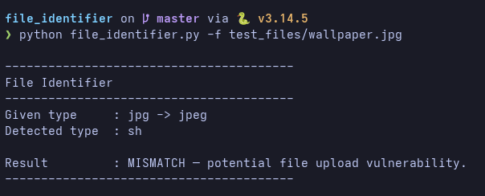

# File Identifier

A command-line tool that detects a file's **real** type by inspecting its contents and compares it against the type **claimed** by the filename extension. A mismatch (e.g. a `.pdf` that is actually a JPEG, or a file with no extension at all) is flagged as a potential file-upload vulnerability.

## Requirements

- Python 3.10+ (uses `str | None` union syntax)
- Third-party packages:
  - [python-magic](https://pypi.org/project/python-magic/) — libmagic bindings (the `magic` import)
  - [olefile](https://pypi.org/project/olefile/) — OLE2 container inspection

```bash
pip install python-magic olefile

# Debian/Ubuntu may also need the system library:
#   sudo apt install libmagic1
```

## Usage

```bash
# Single file — verbose result
python3 file_identifier.py -f test_files/image.jpg

# Whole directory — batch table to stdout
python3 file_identifier.py -d test_files/

# Whole directory — write the batch table to a file
python3 file_identifier.py -d test_files/ -o reports/result.txt
```

| Flag | Description |
|------|-------------|
| `-f`, `--file` | Identify a single file (verbose output). |
| `-d`, `--directory` | Identify every file in a directory (table output). |
| `-o`, `--output_file` | Write batch results to a file instead of stdout (only meaningful with `-d`). |

`-f` and `-d` are a **required, mutually exclusive** group — exactly one must be given.

## Example output

**Single file (`-f`):**



**Batch (`-d`):** one aligned row per file with columns `FILE PATH`, `CLAIMED EXT`, `ACTUAL EXT`, and an `OUTPUT` verdict (`Extensions match`, `MISMATCH`, `Could Not Identify File extension`, or `No file extension`).

## How detection works

`identify_file_type()` runs each file through a pipeline, stopping as soon as the detected type agrees with the (alias-normalized) claimed type:

1. **Magic-byte signatures** (`magic_bytes_inspection.inspect_magic_bytes`) — matches the header against `data/file_signatures.json`. The longest / most-specific match wins.
2. **Container inspection** — if the magic bytes resolve to a generic container:
   - `zip` → `inspect_zip_container()` distinguishes `docx`, `xlsx`, `epub`, `odt`, etc. by reading the archive's mimetype entry and internal paths.
   - `doc` (OLE2) → `inspect_ole_container()` distinguishes `doc`, `xls`, `ppt` by their internal directory entries.
3. **libmagic fallback** (`use_magic_lib`) — when signatures are inconclusive, matches the libmagic description against `data/magic_values.json`.
4. **Text-content parsing** (`text_parser.text_based_format_detection`) — for readable text, sniffs `json`, `csv`, `html`, `xml` (and `kml` / `svg` via XML namespace), defaulting to `txt`.

Finally the claimed extension is normalized through `data/extension_aliases.json` (e.g. `jpg → jpeg`, `dng → tiff`) and compared against the detected type.

## Signature format (`data/file_signatures.json`)

Each entry maps a file type to a list of conditions. A condition is `{"offset": <byte offset>, "signature": "<hex>"}`.

**Single-signature entries** — a flat list; the file matches if *any* condition matches (OR):

```json
"png": [
    {"offset": 0, "signature": "89504e470d0a1a0a"}
],
"tiff": [
    {"offset": 0, "signature": "49492a00"},
    {"offset": 0, "signature": "4d4d002a"}
]
```

**Multi-condition entries** — a list **of lists** (variations). Within a variation all conditions must match (AND); across variations any may match (OR). Used for formats identifiable only by multiple markers at different offsets — the RIFF family (`wav`, `avi`, `webp`), where RIFF@0 is shared and the form-type at offset 8 decides:

```json
"webp": [
    [
        {"offset": 0, "signature": "52494646"},
        {"offset": 8, "signature": "57454250"}
    ]
]
```

The branch is chosen **structurally** at runtime (`isinstance(entry[0], list)`), so no hardcoded type list is needed. Matches are scored by the **sum of matched signature bytes**, letting single- and multi-condition entries compete fairly so the most specific type always wins.

Keys beginning with `__` (e.g. `__comment_image`) are treated as comments and skipped.

## Supporting data files

| File | Purpose |
|------|---------|
| `data/file_signatures.json` | Magic-byte signatures (single- and multi-condition). |
| `data/extension_aliases.json` | Maps alias extensions to a canonical type (`jpg → jpeg`). |
| `data/magic_values.json` | Maps libmagic description prefixes to extensions (fallback). |

## Project layout

```
file_identifier.py          # Entry point: CLI parsing, pipeline orchestration, output
magic_bytes_inspection.py   # Magic-byte matching (single + multi-condition)
text_parser.py              # Text-content detection (json/csv/html/xml/kml/svg)
data/                       # Signature, alias, and magic-value datasets
```

## Limitations

- Some formats have no reliable magic bytes and cannot be detected (raw audio such as `cdda`/`vox`, and proprietary formats such as `bin`/`hcom`); these report `"Could Not Identify File extension"`.
- Verification is via manual corpus runs (`-d test_files/`); there is no automated test suite yet.
