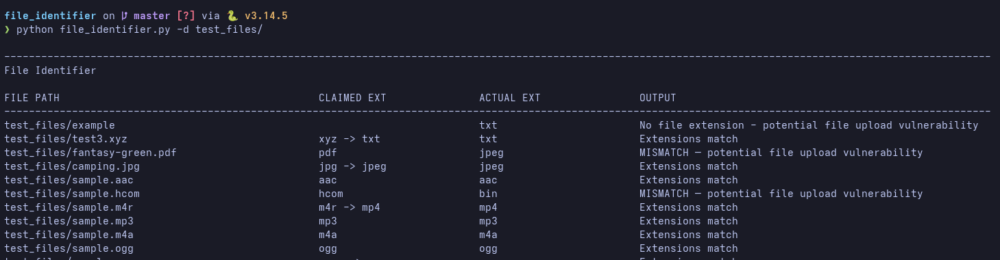

# File Identifier

A command-line tool that detects a file's **real** type by inspecting its contents and compares it against the type **claimed** by the filename extension. A mismatch (e.g. a `.pdf` that is actually a JPEG, or a file with no extension at all) is flagged as a potential file-upload vulnerability.

## Requirements

- Python 3.10+ (uses `str | None` union syntax)
- Third-party packages:
  - [python-magic](https://pypi.org/project/python-magic/) - libmagic bindings (the `magic` import)
  - [olefile](https://pypi.org/project/olefile/) - OLE2 container inspection

```bash
pip install python-magic olefile

# Debian/Ubuntu may also need the system library:
#   sudo apt install libmagic1
```

## Usage

```bash
# Single file - verbose result
python3 file_identifier.py -f test_files/image.jpg

# Whole directory - batch table to stdout
python3 file_identifier.py -d test_files/

# Whole directory - write the batch table to a file
python3 file_identifier.py -d test_files/ -o reports/result.txt
```

| Flag | Description |
|------|-------------|
| `-f`, `--file` | Identify a single file (verbose output). |
| `-d`, `--directory` | Identify every file in a directory (table output). |
| `-o`, `--output_file` | Write batch results to a file instead of stdout (only meaningful with `-d`). |

`-f` and `-d` are a **required, mutually exclusive** group - exactly one must be given.

## Example output

**Single file (`-f`):**


**Batch (`-d`):** 



## Supporting data files

| File | Purpose |
|------|---------|
| `data/file_signatures.json` | Magic-byte signatures (single- and multi-condition). |
| `data/extension_aliases.json` | Maps alias extensions to a canonical type (`jpg → jpeg`). |
| `data/magic_values.json` | Maps libmagic description prefixes to extensions (fallback). |

## Project layout

```
file_identifier.py          # Entry point: CLI parsing, pipeline orchestration, output
magic_bytes_inspection.py   # Magic-byte matching (single + multi-condition)
text_parser.py              # Text-content detection (json/csv/html/xml/kml/svg)
data/                       # Signature, alias, and magic-value datasets
```

## Limitations

- Some formats have no reliable magic bytes and cannot be detected (raw audio such as `cdda`/`vox`, and proprietary formats such as `bin`/`hcom`); these report `"Could Not Identify File extension"`.
- Verification is via manual corpus runs (`-d test_files/`); there is no automated test suite yet.
